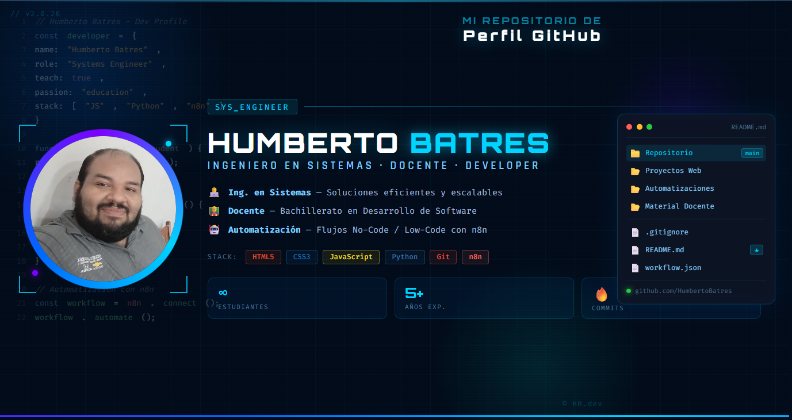

<div align="center">
  
</div>

<br/>

<!-- TYPING ANIMATION -->
<div align="center">
  <a href="https://git.io/typing-svg">
    
  </a>
</div>

<br/>

<!-- SOCIAL BADGES -->
<div align="center">
  <a href="mailto:jose.humberto.batres@clases.edu.sv">
    
  </a>
  &nbsp;
  <a href="https://github.com/1byba3">
    
  </a>
  &nbsp;
  
</div>

<br/>

---

## 🧑‍💻 Sobre Mí

```js
const humberto = {
  nombre     : "Humberto Batres",
  rol        : ["Ingeniero en Sistemas", "Docente", "Developer"],
  ubicación  : "El Salvador 🇸🇻",
  email      : "jose.humberto.batres@clases.edu.sv",
  
  educación  : "Ingeniería en Sistemas",
  docente    : "Bachillerato en Desarrollo de Software",
  
  stack      : ["HTML5", "CSS3", "JavaScript", "Python", "n8n", "Git"],
  intereses  : ["Automatización", "Low-Code", "Enseñanza", "Web Dev"],
  
  filosofía  : "Enseñar es la forma más poderosa de aprender 📚"
};
```

<br/>

---

## 🛠️ Tecnologías & Herramientas

<div align="center">

### 🌐 Desarrollo Web


### ⚙️ Automatización & Control de Versiones


&nbsp;
[](https://n8n.io/)

</div>

<br/>

---

## 📊 Estadísticas de GitHub

<div align="center">
  
  &nbsp;
  
</div>

<br/>

<div align="center">
  
</div>

<br/>

<div align="center">
  
</div>

<br/>

---

## 🚀 Proyectos Destacados

<div align="center">
  <a href="https://github.com/1byba3/mi-repo-de-la-formacion-docente">
    
  </a>
  &nbsp;
 
</div>

<br/>

---

## 🎓 Enfoque Docente

<div align="center">

| 📚 Área | 🛠️ Herramientas | 🎯 Objetivo |
|---------|----------------|-------------|
| Lógica de Programación | Python, JavaScript | Pensamiento computacional |
| Desarrollo Web | HTML, CSS, JS | Frontend práctico |
| Control de Versiones | Git, GitHub | Flujo colaborativo |
| Automatización | n8n | Productividad real |

</div>

<br/>

---

## 🏆 Trofeos GitHub

<div align="center">
  
</div>

<br/>

---

## 📫 Conectemos

<div align="center">
  <a href="mailto:jose.humberto.batres@clases.edu.sv">
    
  </a>
</div>

<br/>

<div align="center">
  
</div>
